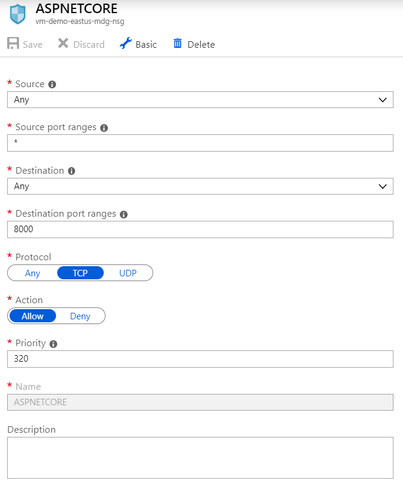
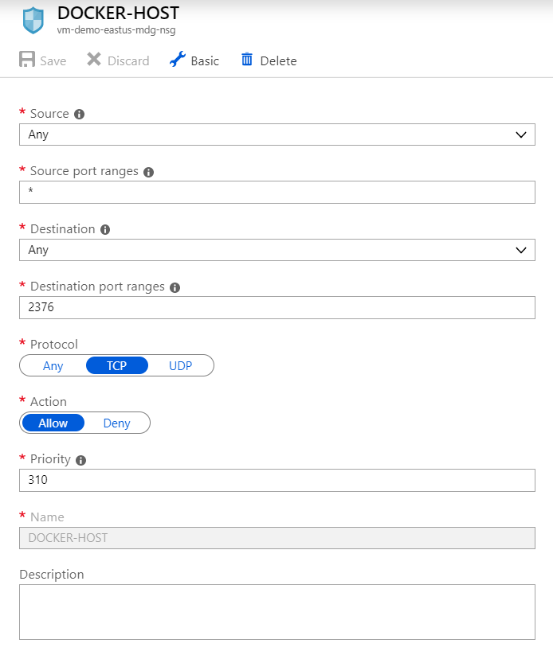
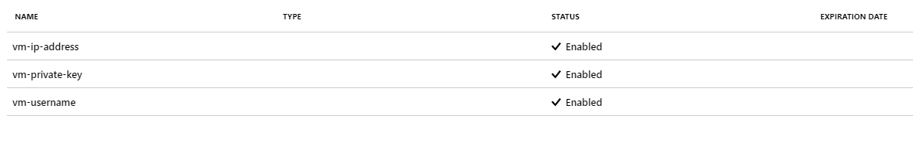
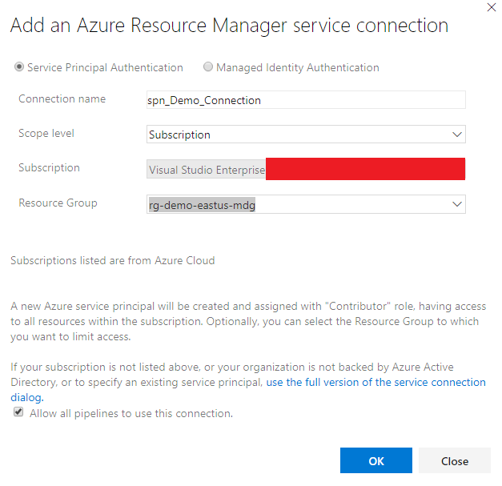
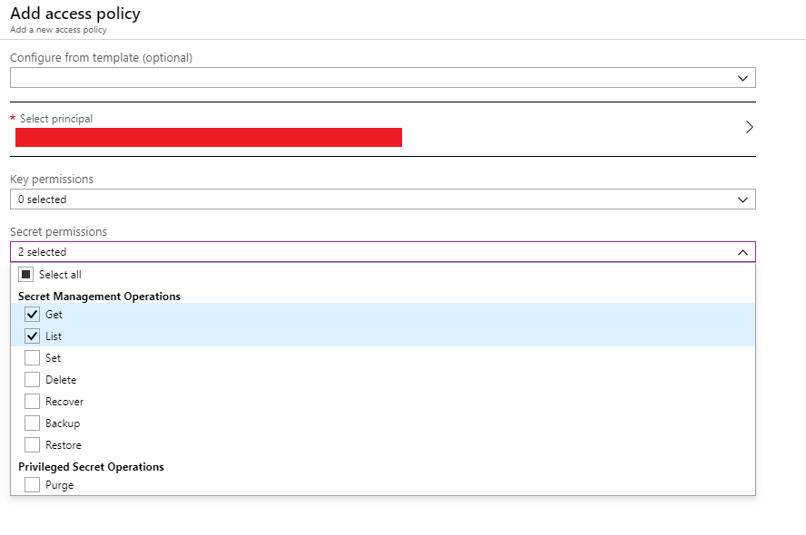
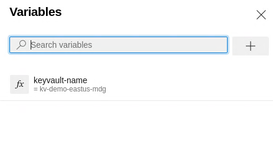
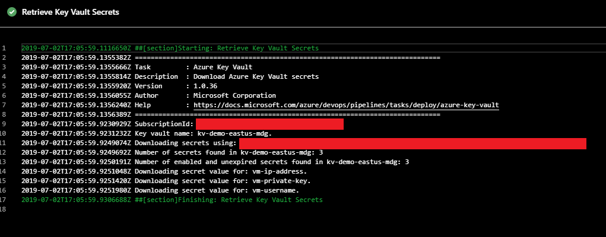
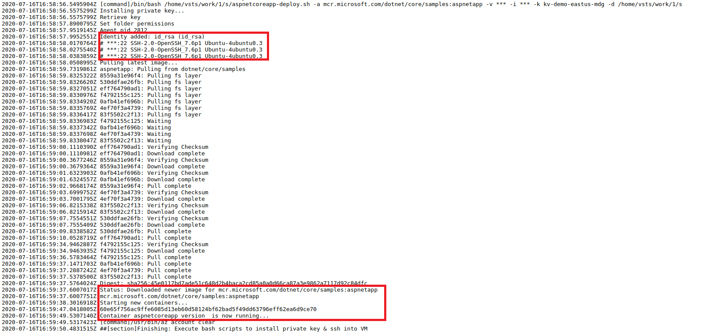

# Install Private Key on a Azure DevOps Hosted Agent & SSH into a Azure Virtual Machine

Demonstrate how to install an SSH Private Key located in an Azure Key Vault on an Azure DevOps Hosted Agent and SSH into a Azure Virtual Machine using Docker Host.

## Prerequisites

* azure-cli
* Azure DevOps
* Azure Subscription
* Bash
* GitHub Account
* Mac/Ubuntu/[WSL](https://docs.microsoft.com/en-us/windows/wsl/install-win10)

## Caveats

This tutorial entry is not an exhaustive tutorial on Azure, Azure Virtual Machines, Azure DevOps, Azure Key Vault, Bash, Docker, Public Key Encryption or the SSH Protocol. This tutorial assumes the reader has a fundamental knowledge of the aformentioned technologies and concepts.

Also, in this tutorial entry I open up a number of ports on an Azure Virtual Machine. **For brevity and to keep this guide as simple as possible, the "best" security practices are not used when opening these ports and should not serve as an example for a live environment**.

This repository contains 2 Bash scripts that will install a Private Key on an Azure DevOps Hosted Agent and deploy the ASP.Net Core Sample Docker container to an Azure Virtual Machine. You will need to clone the GitHub repository.

Please view the [README](./docs/README.md) for a detailed description of how the Bash scripts work.

## Background

On my latest project here at Microsoft, we are using Terraform to deploy our infrastructure to the Azure Cloud. One of the resources that is deployed are Virtual Machines that run docker containers and the information about these Virtual Machines (username, ip address etc etc) is stored in an Azure Key Vault via Terraform. To automate the container deployment process, we needed to create a Azure DevOps Pipeline that would:

1. Retrieve the username & IP Address of the Virtual Machine from Azure Key Vault
1. Retrieve an SSH Private Key that has been Base64 encoded from Azure Key Vault
1. Install the SSH Private Key on the Azure DevOps Hosted Build Agent
1. SSH into the Azure Virtual Machine and deploy a new version of a Docker container

Azure DevOps has a built in SSH Task to SSH into a Virtual Machine but unfortunately, the Service Connection this task uses requires you to hard-code the IP Address and Port into the Service Connection which would not work for us because we needed to have these values (along with other values) in an Azure Key Vault, which could be accessed programmically in order to support automating Docker container deployments to an Azure Virtual Machine.

## Create and Configure Azure Resources

Log into Azure:

```bash
  az login
```

Create an Azure Resource Group:

```bash
  az group create -l eastus -n {name_resouce_group}
```

Create an Azure Key Vault:

```bash
  az keyvault create -n {name_of_keyvault} -g {name_of_group} -l eastus --sku standard
```

Now we need to create a Azure Key Vault secret that will contain a Private Key. For brevity, I am using the Private Key stored on my Hyper-V Ubuntu 18.04 development machine. If you are unfamiliar with generating SSH Key Pairs on Ubuntu, please see the tutorial on [ssh-keygen](https://www.ssh.com/ssh/keygen/).

```bash
  # copy private key into a variable, Base64 encode the variable and save it into the azure key vault as a secret
  # we Base64 encode the private key to preserve the characters
  privatekey=$(base64 ~/.ssh/id_rsa) && az keyvault secret set -n {name_of_secret} --vault-name {name_of_key_vault} --value "$privatekey"
```

To test that the Private Key was saved, you can run the following command:

```bash
  echo $(az keyvault secret show -n {name_of_secret} --vault-name {name_of_key_vault} --query 'value' --output tsv) | base64 -di
```

We now need to create an Azure Virtual Machine, so we can store the username & IP Address in Azure Key Vault:

Since we will be using SSH, I need to copy "Public" key located on my Hyper-V development machine, which will be copied to the Azure Virtual Machine's [authorized_keys](https://www.ssh.com/ssh/authorized_keys/) directory:

```bash
  cat ~/.ssh/id_rsa.pub
```

In the [Azure Portal](https://portal.azure.com/):

1. Choose Virtual Machine and Add a Virtual Machine
1. Choose Ubuntu 18.04 LTS as the OS
1. Choose a name
1. Choose a Resource Group
1. Copy the "Public" key into SSH Public Key text area
1. Change the size of the Virtual Machine to a "Standard B1ms"
1. Choose to open port 22 (SSH)
1. Choose a Standard HDD

Once you have done this, review and create the Virtual Machine. We will need to open a few other ports:

1. Choose Networking
1. Choose "Add inbound port rule"
1. Add an entry for Ports 2376 (docker daemon encrypted communication port) and 8000 (port used by the ASP.Net Core Sample App)

As noted, only do this for learning purposes and always follow proper security protocols for live environments.





We need to now SSH into the Azure Virtual Machine and install docker. You can find the IP Address of the Virtual Machine in the Overview blade:


SSH into the Virtual Machine and install Docker:

```bash
  ssh {username_of_virtual_machine}@{ip_address_of_virtual_machine}
```

Use the [official](https://docs.docker.com/install/linux/docker-ce/ubuntu/) Docker guide to install Docker on Ubuntu.

We will also want to place the Virtual Machine user in the [docker](https://docs.docker.com/install/linux/linux-postinstall/) group:

```bash
  sudo groupadd docker && sudo usermod -aG docker $USER
```

We will need to reboot for the changes to take effect:

```bash
  sudo reboot
```

We need to store the Virtual Machine username and IP Address in Azure Key Vault as secrets:

```bash
  az keyvault secret set -n vm-ip-address --vault-name {name_of_key_vault} --value {ip_address}
```

```bash
  az keyvault secret set -n vm-username --vault-name {name_of_key_vault} --value {virtual_machine_username}
```

Here are the secret names I used:



## Create a Azure DevOps Release Pipeline

We now need to let Azure DevOps create a Service Principal, which will be used to execute our Bash scripts.

In Azure DevOps:

1. Create a new Project
1. Inside the Project, choose Project Settings
1. Choose Service Connection
1. Choose Azure Resource Manager

Fill in the appropriate information. The end result should be something similar to the picture below:


After the Service Principal has been created, select the Service Principal and choose "Manage Service Principal". You will be taken to the Azure Portal where you can copy the display name of the new Service Principal Azure DevOps created.

We need to grant the new Service Principal the correct permissions to be able to retrieve values from the Azure Key Vault. In the Azure Portal:

1. Choose the Azure Key Vault that was created
1. Choose the "Access policies" blade
1. Choose "Add new"
1. Paste the Service Principal name in the search bar to find the Service Principal
1. Grant Get and List permissions, similar to the image below



Now let's create the Release Pipeline that will execute the Bash scripts.

In Azure DevOps:

1. Choose Pipelines
1. Choose Releases
1. Create a New Release Pipeline
1. Select the GitHub Repository you cloned as the Artifacts
1. Select Existing Azure Pipelines YAML file & choose *azure-pipelines.yml*

We need to create the variables that the "aspnetcoreapp-deploy.sh" uses:

Under the "Variables" tab, create the following variables:

* keyvault-name: {key_vault_name}



The sample [azure-pipelines.yml](azure-pipeline.yml) file does the following:

1. Retrieve the Azure KeyVault secrets & store as CI/CD Environment Variables
1. Execute the [aspnetcoreapp-deploy.sh](aspnetcoreapp-deploy.sh) script to:
     1. Install the private key on on the CI/CD build server
     1. Use Docker Host to SSH into the Virtual Machine
     1. Download a docker image & start the container

## Run Azure DevOps Release Pipeline & Test ASP.Net Core Sample Application

Now that we have created the Release Pipeline, we can hit the "Create release" button at the top right to create a release.





Testing the ASP.Net Core Sample Application by navigating to "http://{virtual_machine_ip_address}:8000"


